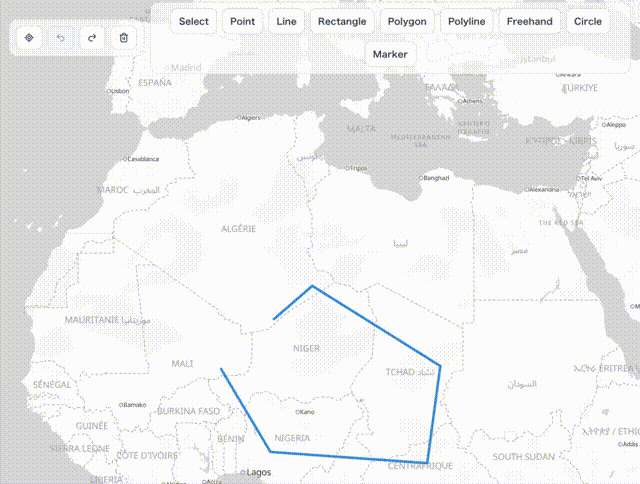
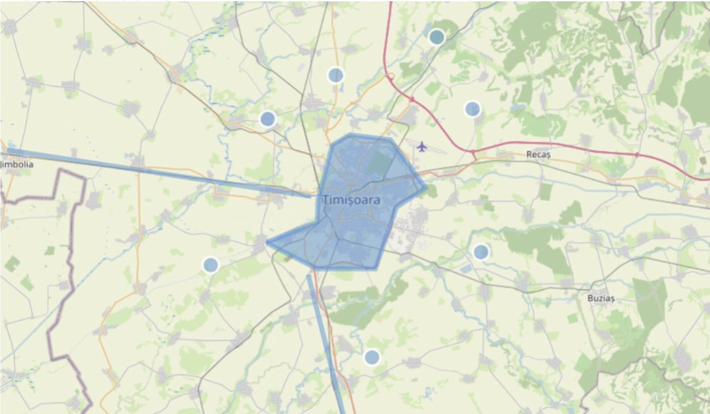
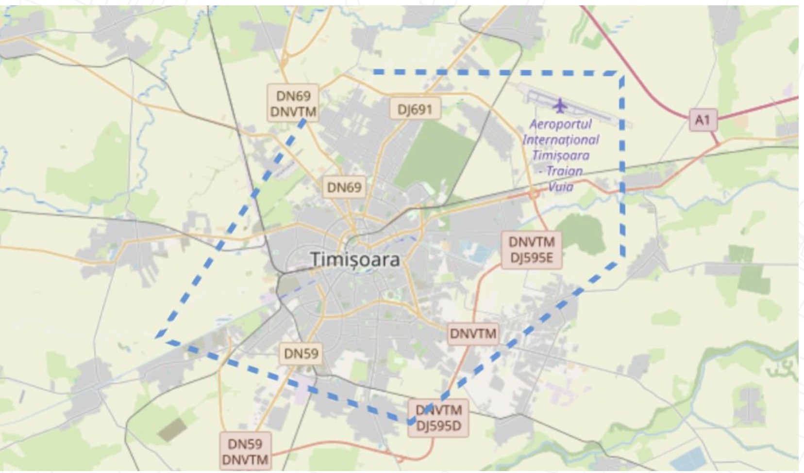
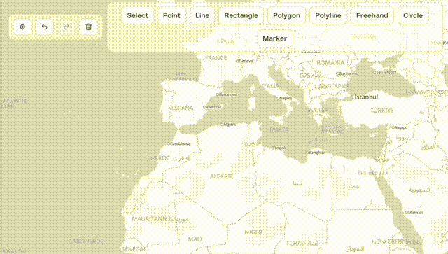
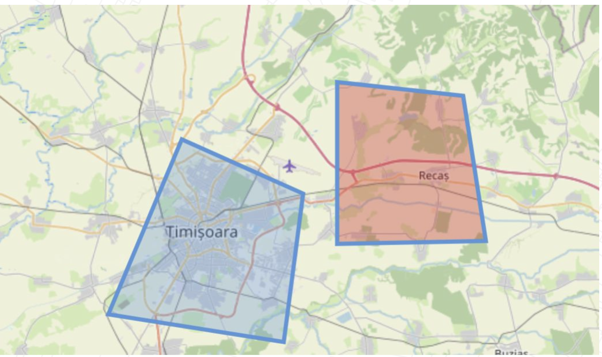
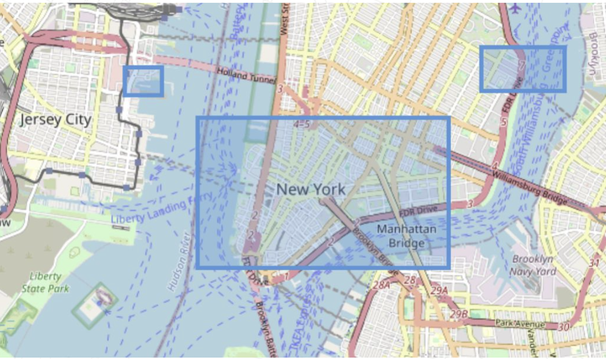
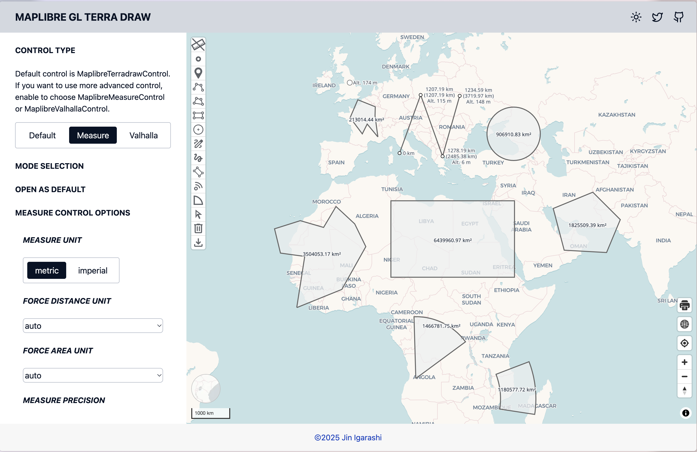
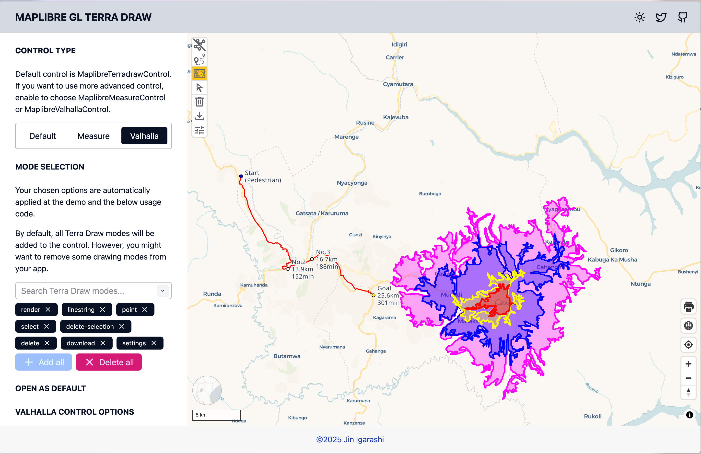
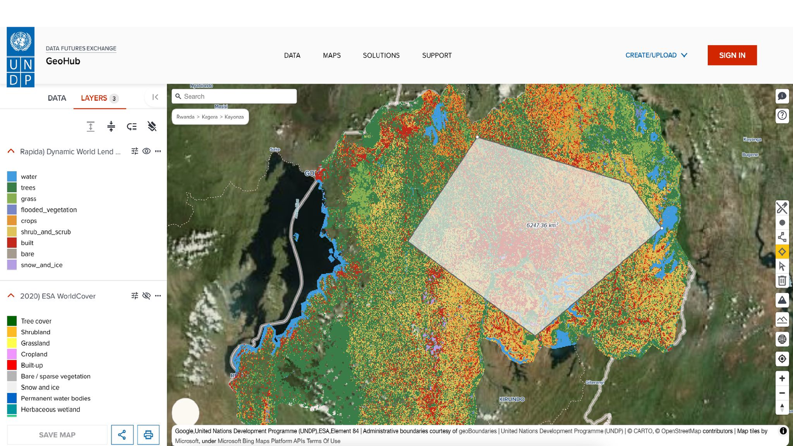

# Terra Draw - あらゆる地図アプリケーションに描画機能を

## Terra Draw とは

はじめての方への紹介

### ウェブ地図上での描画は簡単そうに見える

自分で作るまでは。

- クリックで頂点を追加し、ドラッグで動かし、隣の頂点にスナップさせる
- ユーザーが描いている最中もジオメトリを正しい状態に保つ
- 元に戻す、やり直す、選択する、削除する
- そして次の地図ライブラリで、また同じことを一からやる

### 地図ライブラリごとに、それぞれの答えがあった


Leaflet.draw、leaflet-freedraw、mapbox-gl-draw... API も挙動もバグもばらばらで、
描画のコードは1つの地図に縛られてしまう。

### Terra Draw

ウェブ地図上で描画するためのオープンソースの TypeScript ライブラリ。
約 4 年前に **James Milner** さんが作りました。

描画エンジンは1つ、地図はたくさん。

```bash
npm install terra-draw
```

### 目指したこと

- 地図ライブラリ横断の対応
- カスタムモード
- 細かなスタイル制御
- 依存関係ゼロ

### 全体の構成


**アダプター**が地図とやり取りし · **モード**が操作を担い · **ストア**が
GeoJSON を保持する。

### 1 つの API で、たくさんの地図へ


アダプターを差し替えるだけ。あとはそのまま。

### 描画を担うのはモード

- `point`、`linestring`、`polygon`、`marker`、`polyline`
- `rectangle`、`angled-rectangle`、`circle`、`sector`、`sensor`
- `freehand`、`freehand-linestring`
- `select` — 移動・回転・拡大縮小・削除
- ...独自のモードを書くこともできる

## はじめよう

Terra Draw で何ができるのか

### 数行でセットアップ

```ts
import { TerraDraw, TerraDrawPolygonMode } from 'terra-draw';
import { TerraDrawMapLibreGLAdapter } from 'terra-draw-maplibre-gl-adapter';

const draw = new TerraDraw({
  adapter: new TerraDrawMapLibreGLAdapter({ map }),
  modes: [new TerraDrawPolygonMode({ snapping: true })]
});

draw.start();
draw.setMode('polygon');
```

### データはただの GeoJSON

```ts
draw.on('finish', (id) => {
  const snapshot = draw.getSnapshot();
  const feature = snapshot.find((f) => f.id === id);
  console.log(JSON.stringify(feature));
});
```

`getSnapshot()` / `addFeatures()` — GeoJSON を扱えるものとなら何とでも、
フィーチャーの読み込み・保存・往復ができる。

## 2026 年の新機能

プロジェクトですぐ使える新しい機能

### 元に戻す / やり直す



どんな描画アプリにもある機能で、最も要望が多かったものの 1 つ。
そして、正しく作るのが難しい。

### 2 段階の仕組み

- **描画中**の undo / redo — 1 つのモードの中で働く
- **セッション**の undo / redo — モードをまたいで働く
- 併用しても、片方だけでも使える

```ts
draw.undo();
draw.redo();
```

### スタイル機能の強化



ジオメトリのスタイル指定の幅が広がりました。スタイルのコールバックはフィーチャーを
受け取るので、色・太さ・不透明度を独自のプロパティから決められます。

---



line モードが破線に対応しました。新しい `lineStringDash` スタイルプロパティを使います。

### ポリラインモード



線として描き始めて、そのまま面として閉じられます。モードを切り替える必要はありません。

### 同じモードの複数インスタンス



1 つのモードを別々の設定で 2 回登録できます。たとえばスタイルとバリデーションの
異なる 2 つのポリゴンモードを同時に使えます。

### 新しい描画操作



クリック & ドラッグに対応。角を 1 つずつクリックする代わりに、矩形や円を
ひと続きの操作で描けます。

### とはいえ UI は自分で作る必要がある

Terra Draw が提供するのは描画エンジンです。ボタン、モードの切り替え、
地図のコントロールは自分で書くことになります。

## maplibre-gl-terradraw

MapLibre GL JS 用のプラグイン。Terra Draw と、すぐ使えるコントロールをセットで。

### コントロールの追加は 1 行

```bash
npm install @watergis/maplibre-gl-terradraw
```

あとは 1 行書くだけで、MapLibre の地図にコントロールを追加できます。

```ts
import { MaplibreTerradrawControl } from '@watergis/maplibre-gl-terradraw';

map.addControl(
  new MaplibreTerradrawControl({ open: true }),
  'top-left'
);
```

### 計測コントロール



`MaplibreMeasureControl` は、描いたジオメトリに距離と面積のラベルを追加します。

### Valhalla コントロールでルーティング



線を描けばルートが返ってきます。到達圏とルーティングのコントロールが、
描いたジオメトリを API リクエストに変換します。

### 事例 - UNDP の GeoHub



UNDP の **GeoHub** では、描画と計測にこのプラグインを使っています。

## コントリビューション

Terra Draw プロジェクトへの参加方法

### 貢献するには

- GitHub でスターを付ける
- バグを見つけたら、再現手順の明確な issue を投稿する
- issue トラッカーで議論し、プルリクエストを送る
- 興味があれば、講演のあとにぜひ話しましょう!

### リンクと参考資料

- Terra Draw — <https://terradraw.io> · <https://github.com/JamesLMilner/terra-draw>
- プラグイン — <https://terradraw.water-gis.com>
- ワークショップ教材 - <https://workshops.terradraw.water-gis.com>

#### 自分で試してみる

FOSS4G 2026 のワークショップでは、ここまでの内容をすべてブラウザ上で扱います。
どのページにもライブエディタがあります。

Terra Draw ワークショップ - <https://workshops.terradraw.water-gis.com/workshops/foss4g2026/>

インストールもビルドも不要 — コードを編集すれば地図が更新されます。

## 質問はありますか?

ご清聴ありがとうございました
