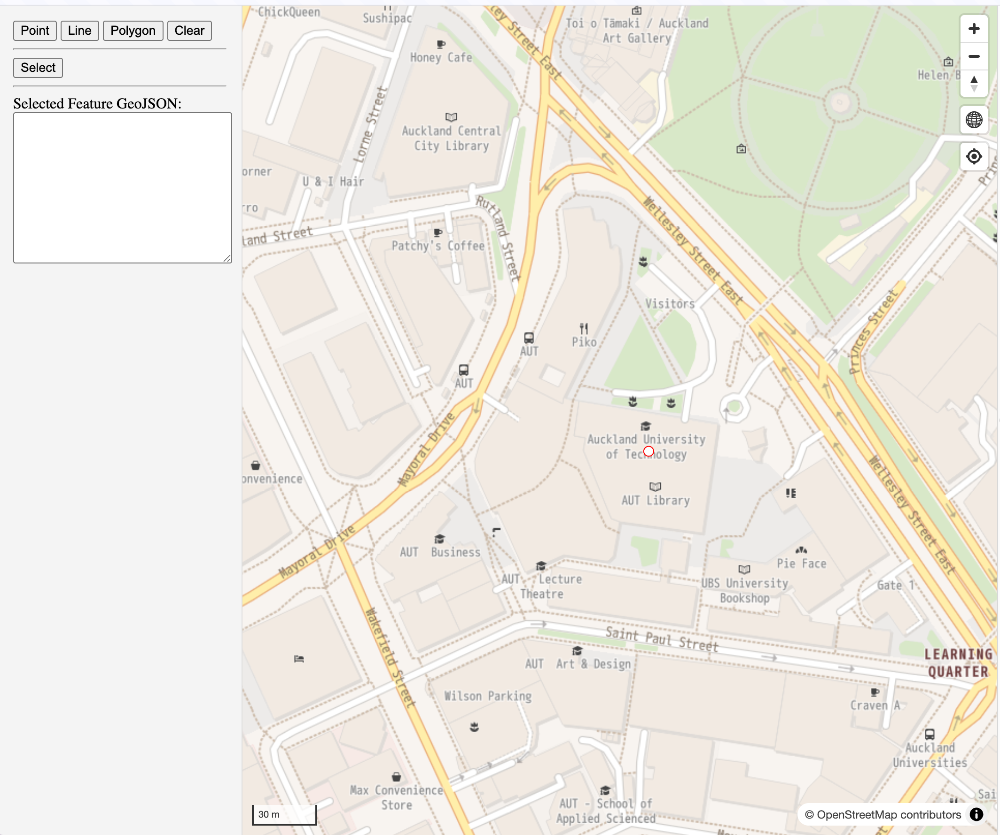
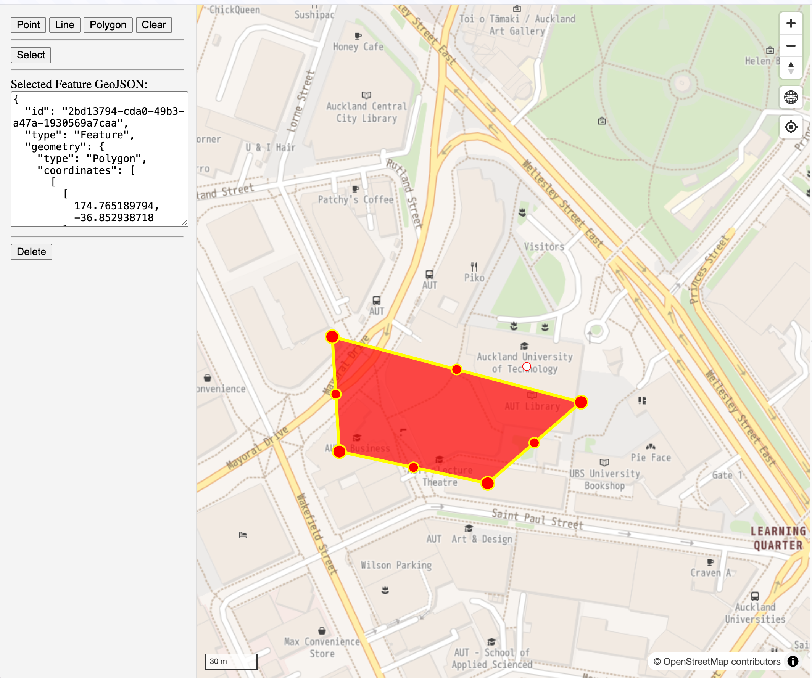

# Data Management

Terra Draw provides powerful data management capabilities following the [official store documentation](https://github.com/JamesLMilner/terra-draw/blob/main/guides/2.STORE.md).

## Add GeoJSON features to Terra Draw store

You can add features programmatically by using `draw.addFeatures`:

Let's add a default point at Auckland University of Technology when a page is initially loaded.

Add the below code in the last of `map.once('load')` event.

```ts
// Add a default point feature at Auckland University of Technology
draw?.addFeatures([
    {
        id: '39d86739-6012-40ae-bb8c-3cb0f0694b92',
        type: 'Feature',
        geometry: {
            type: 'Point',
            coordinates: [174.766430366, -36.85309055]
        },
        properties: {
            mode: 'point'
        }
    }
]);
```

!!! note
    `mode` property must exist in GeoJSON properties and corresponding mode must be added to Terra Draw in advance.



## Get features from Terra Draw store

In the last exercise 5, we already used to fetch feature from Terra Draw store.

```ts
// get all features from store
const features = draw.getSnapshot();

// get feature by ID from store
const feature = draw.getSnapshotFeature(id);
```

## Delete selected feature by UI

Let's add a delete button to allow users to remove selected feature.

Add the below `handleDeleteClick` method in script tag section

```ts
const handleDeleteClick = () =>{
    const targetFeature = selectedFeature ? JSON.parse(selectedFeature) : null;
    if (targetFeature && targetFeature.id) {
        draw?.removeFeatures([targetFeature.id]);
    }
};
```

Then, add the following HTML in the last of sidebar class.

```html
<!-- Add delete mode button here -->
<hr />
<button onclick={handleDeleteClick} disabled={!selectedFeature}>Delete</button>
```

You should be able to remove a selected feature by clicking `Delete` button.



### Testing Your Implementation

1. **Save your changes** and the Vite development server should automatically reload
1. **Open your browser** to `http://localhost:5173`
1. **Check initial point is on the map**: confirm the point is shown at AUT.
1. **Test Delete button** to ensure only selected feature is deleted from store.

### Example code

The above example code is available at [example/data-management](https://github.com/watergis/terradraw-workshop-template/tree/example/data-management) branch.

## What's Next?

Now, you have mastered most core functionalities of Terra Draw with Maplibre GL JS.

In the next step, we are going to learn how Leaflet - one of the most popular mapping library, integrated with Terra Draw.