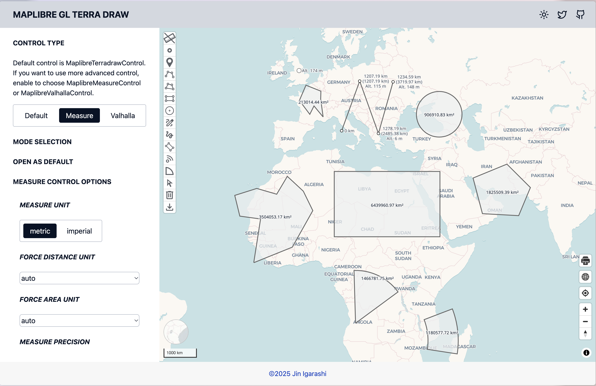
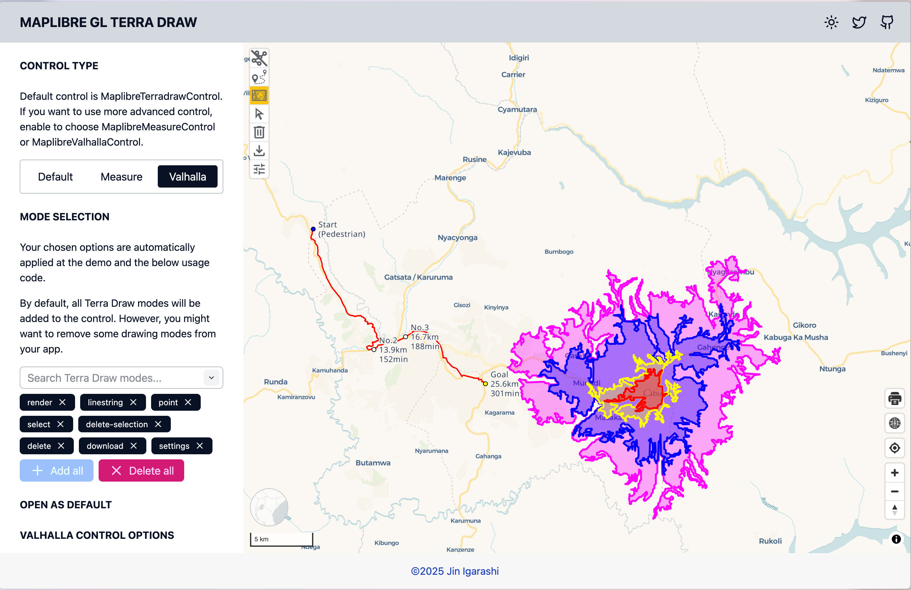

# Maplibre TerraDraw plugin

This section will learn a maplibre plugin for easy integration with TerraDraw.

## maplibre-gl-terradraw

Through this workshop tutorials of Maplibre and Leaflet, now you have understood how TerraDraw works across different mapping libraries.

However, you still need to write quite a lot of codes to bring TerraDraw to your map application.

maplibre-gl-terradraw is developed for easy integration with maplibre.

## Installation

Install the library like so.

```bash
pnpm add --save-dev @watergis/maplibre-gl-terradraw
```

## Usage

Just add the four line of codes to your maplibre application

```ts
import { MaplibreTerradrawControl } from '@watergis/maplibre-gl-terradraw'
import '@watergis/maplibre-gl-terradraw/dist/maplibre-gl-terradraw.css'

const draw = new MaplibreTerradrawControl();
map.addControl(draw, 'top-left');
```

## Supported TerraDraw modes

All TerraDraw modes are supported, and additional functionalities (delete, download buttons).

## Available controls

There are following three controls available in the plugin.

| Control | Description |
| --- | --- |
| MaplibreTerradrawControl | Standard control for drawing |
| MaplibreMeasureControl | Control for measuring distance, area and altitude |
| MaplibrevalhallaControl | Control for integrating with Valhalla API (Routing and Isochrone) |





## All TerraDraw APIs are accessible

Through the plugin, all TerraDraw APIs are accessible via the plugin contructor and `getTerraDrawInstance` method.

```ts
const drawControl = new MaplibreTerradrawControl({
    modes: ['polygon', 'select', 'delete'], // choose what buttons are needed
    open: true, // set default state either expanded or collapsed
    modeOptions: // You can pass your own TerraDraw mode options to the plugin to override default setting
    adapterOptions: // You can pass your own adapter setting to the plugin
});

// You can get TerraDraw instance from the plugin to do whatever you want
const draw = drawControl.getTerraDrawInstance()
// do something
```

## Demo

Open https://terradraw.water-gis.com/ for the demo of maplibre-gl-terradraw

13 examples are avalable how to configure TerraDraw and the plugin.

## Source code

GitHub repository is at [watergis/maplibre-gl-terradraw](https://github.com/watergis/maplibre-gl-terradraw).
