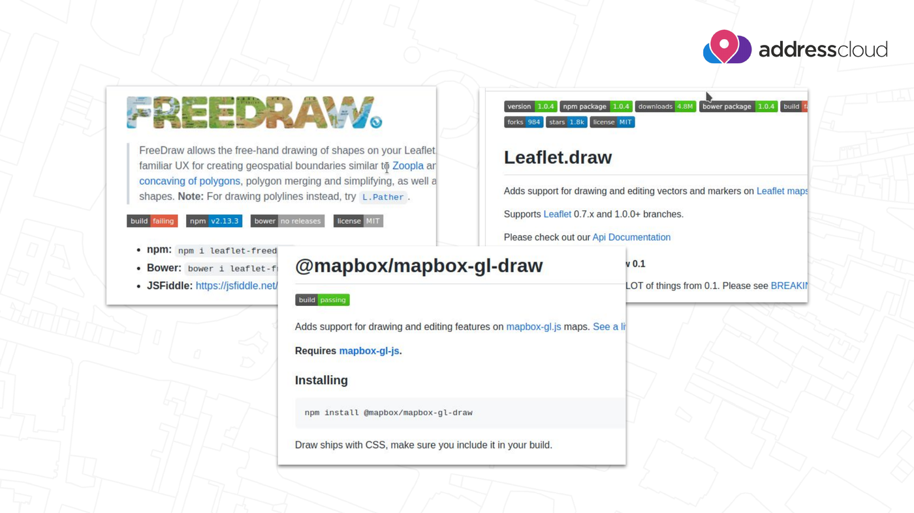
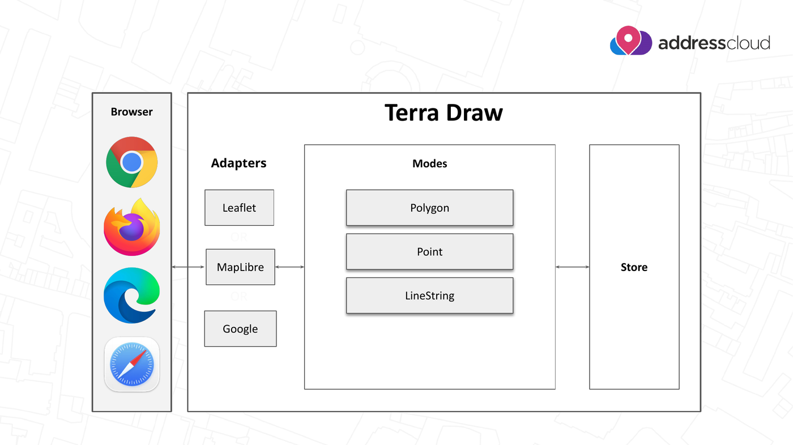
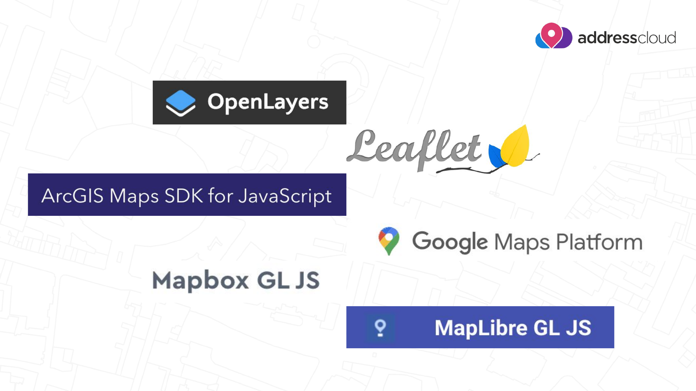

# Terra Draw Introduction

Before we install anything, let's look at what Terra Draw is, the problem it
solves, and where the project stands in 2026.

## What is Terra Draw?

[Terra Draw](https://terradraw.io) is an MIT licensed, zero dependency
JavaScript library for **drawing geometries on web maps**. Instead of being tied
to one mapping library, it provides a single API that works across six of them —
MapLibre GL JS, Leaflet, OpenLayers, Mapbox GL JS, Google Maps and the ArcGIS
Maps SDK.

It is created and maintained by [James Milner](https://github.com/JamesLMilner),
and the source lives at
[JamesLMilner/terra-draw](https://github.com/JamesLMilner/terra-draw).

```bash
npm install terra-draw
```

## Why does it exist?

Drawing on a web map has always been possible, but historically every mapping
library had its own drawing plugin — with its own API, its own quirks, and in
several cases no active maintenance.



*The pre-Terra Draw landscape: FreeDraw and Leaflet.draw for Leaflet,
`@mapbox/mapbox-gl-draw` for Mapbox GL JS. Slide from James Milner's
[FOSS4G Europe 2026 talk](https://talks.osgeo.org/foss4g-europe-2026/talk/SVK98A/).*

That meant switching your base map library — something a lot of projects did
after the Google Maps and Mapbox licensing changes — also meant rewriting your
entire drawing layer. Terra Draw removes that coupling: the drawing logic stays
the same, and only the adapter changes.

## Design goals

Terra Draw is built around four goals:

- **Cross map library support** — the same code runs on any supported library
- **Custom modes** — you can write your own drawing tools, not just use built-ins
- **Deep styling control** — every geometry can be styled, including per-feature
- **Zero dependency** — no transitive packages pulled into your bundle

## Architecture



*Terra Draw architecture. Slide from James Milner's
[FOSS4G Europe 2026 talk](https://talks.osgeo.org/foss4g-europe-2026/talk/SVK98A/).*

Three concepts carry through every exercise in this workshop:

| Concept | What it does |
| --- | --- |
| **Adapter** | Binds Terra Draw to one specific map library, e.g. `TerraDrawMapLibreGLAdapter` |
| **Modes** | The drawing tool currently in use, e.g. `TerraDrawPolygonMode`, `TerraDrawPointMode`, `TerraDrawSelectMode` |
| **Store** | The GeoJSON features you have drawn — the single source of truth you read from and write to |

Putting them together always looks like this:

```ts
const draw = new TerraDraw({
    adapter: new TerraDrawMapLibreGLAdapter({ map }),
    modes: [new TerraDrawPolygonMode()]
});

draw.start();
draw.setMode('polygon');
```

We look at each concept in detail — and run this code for real — in
[Core Concepts](./basics/index.md) and [Exercise 1](./basics/exercise-1.md).

## Supported map libraries



*The six mapping libraries Terra Draw supports. Slide from James Milner's
[FOSS4G Europe 2026 talk](https://talks.osgeo.org/foss4g-europe-2026/talk/SVK98A/).*

Each library gets its own adapter package:

- **MapLibre GL JS** — `TerraDrawMapLibreGLAdapter` (used throughout this workshop)
- **Leaflet** — `TerraDrawLeafletAdapter`
- **OpenLayers** — `TerraDrawOpenLayersAdapter`
- **Mapbox GL JS** — `TerraDrawMapboxGLAdapter`
- **Google Maps** — `TerraDrawGoogleMapsAdapter`
- **ArcGIS Maps SDK for JavaScript** — `TerraDrawArcGISMapsSDKAdapter`

We rewrite the same exercise for each of them in
[Other mapping libraries](./other-libraries/index.md).

## What's new in 2026?

Terra Draw has moved quickly since the 2025 edition of this workshop. The
highlights below follow James Milner's talk
[**Terra Draw: What's new for 2026?**](https://talks.osgeo.org/foss4g-europe-2026/talk/SVK98A/)
at FOSS4G Europe 2026.

- **Undo / redo (v1.26)** — a long-requested feature, and a hard one to build.
  It is a two part system: *mode level* undo/redo works while you are drawing a
  single feature, and *session level* undo/redo works across modes on completed
  changes. They can be used together or independently.
  → [Exercise 7](./advanced/exercise-7.md)
- **Styling improvements** — per-feature opacity for points, linestrings and
  polygon outlines (v1.24), and dashed line support (v1.30, extended with
  styling functions in v1.32).
  → [Exercise 4](./advanced/exercise-4.md)
- **Polyline mode (v1.31)** — draw a line and finish it as a LineString, or
  click its first point again to close it into a Polygon, the way many desktop
  GIS tools behave.
  → [Exercise 2](./basics/exercise-2.md)
- **Multiple instances of the same mode (v1.19)** — give each instance its own
  `modeName` and run, say, two polygon modes with different configuration and
  styling side by side.
  → [Core Concepts](./basics/index.md)
- **Click and drag drawing** — rectangle and circle modes can now be drawn by
  dragging, instead of clicking once per corner. See the
  [Modes guide](https://github.com/JamesLMilner/terra-draw/blob/main/guides/4.MODES.md).

!!! tip
    The full talk description and the original slides are on the
    [FOSS4G Europe 2026 programme page](https://talks.osgeo.org/foss4g-europe-2026/talk/SVK98A/).

## Getting involved

Terra Draw is an open source project and welcomes contributions:

- Star the repository at
  [JamesLMilner/terra-draw](https://github.com/JamesLMilner/terra-draw)
- If you find a bug, open a clear, reproducible
  [issue](https://github.com/JamesLMilner/terra-draw/issues)
- Discuss issues on the tracker and raise pull requests

## What's Next?

Now that you know what Terra Draw is, let's get your environment ready.

[Continue to Getting Started](./getting-started.md)
