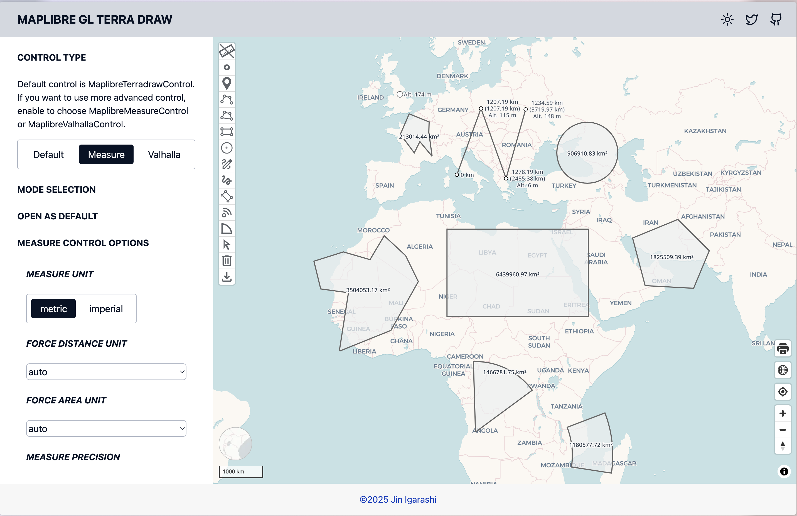
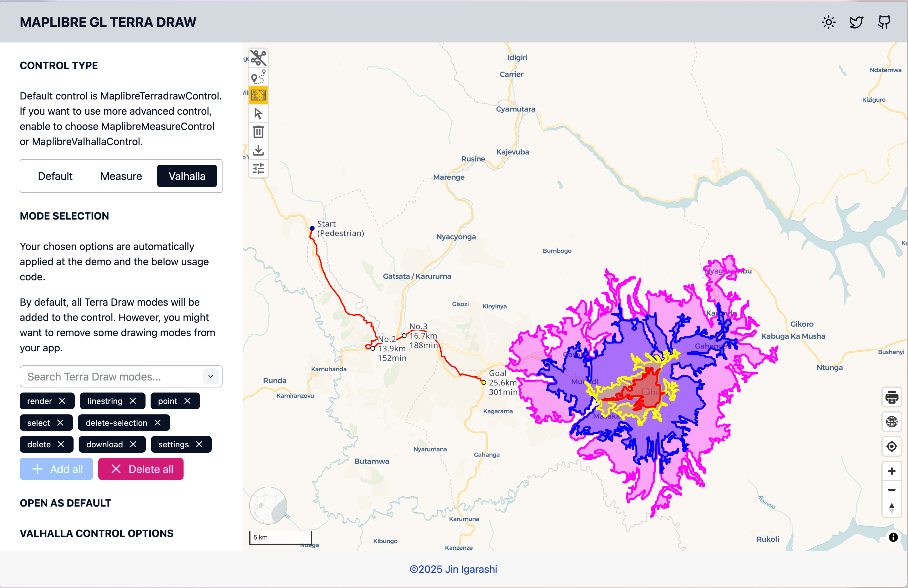

# MapLibre Terra Draw plugin

This section introduces a MapLibre plugin for easy integration with Terra Draw.

## maplibre-gl-terradraw

Through the previous exercises you have now seen how Terra Draw works and how
much control it gives you. However, you still need to write quite a lot of
code to bring a full drawing UI to your map application.

[maplibre-gl-terradraw](https://github.com/watergis/maplibre-gl-terradraw)
was developed for easy integration with MapLibre: it wraps Terra Draw in a
standard MapLibre control with ready-made buttons.

## Installation

```bash
pnpm add --save-dev @watergis/maplibre-gl-terradraw
```

## Usage

Just add a few lines of code to your MapLibre application:

```ts
import { MaplibreTerradrawControl } from '@watergis/maplibre-gl-terradraw';
import '@watergis/maplibre-gl-terradraw/dist/maplibre-gl-terradraw.css';

const drawControl = new MaplibreTerradrawControl();
map.addControl(drawControl, 'top-left');
```

## Try it in the live editor

Add the control with your favourite selection of modes. The plugin supports
all Terra Draw modes — including `polyline`, `undo` and `redo` buttons — plus
extra buttons like `delete` and `download`.

<terra-draw-editor start="../code/maplibre-gl-terradraw/start.ts" answer="../code/maplibre-gl-terradraw/answer.ts" height="500"></terra-draw-editor>

!!! note
    The plugin's stylesheet is already loaded in the live editor's preview.
    In your own project, don't forget to import
    `@watergis/maplibre-gl-terradraw/dist/maplibre-gl-terradraw.css`.

## Available controls

There are three controls available in the plugin:

| Control | Description |
| --- | --- |
| MaplibreTerradrawControl | Standard control for drawing |
| MaplibreMeasureControl | Control for measuring distance, area and altitude |
| MaplibreValhallaControl | Control for integrating with the Valhalla API (routing and isochrones) |





## All Terra Draw APIs are accessible

Through the plugin, all Terra Draw APIs are accessible via the plugin
constructor and the `getTerraDrawInstance` method:

```ts
const drawControl = new MaplibreTerradrawControl({
    modes: ['polygon', 'select', 'delete'], // choose which buttons are needed
    open: true, // set default state either expanded or collapsed
    modeOptions: {}, // pass your own Terra Draw mode options to override default settings
    adapterOptions: {} // pass your own adapter settings
});

// You can get the Terra Draw instance from the plugin to do whatever you want
const draw = drawControl.getTerraDrawInstance();
// do something
```

## Demo

Open <https://terradraw.water-gis.com/> for the demo of maplibre-gl-terradraw.

Many examples are available showing how to configure Terra Draw and the plugin.

## Source code

The GitHub repository is at [watergis/maplibre-gl-terradraw](https://github.com/watergis/maplibre-gl-terradraw).

## What's Next?

Finally, let's see how the very same Terra Draw code works with other mapping libraries.

[Continue to Other mapping libraries](./other-libraries.md)
